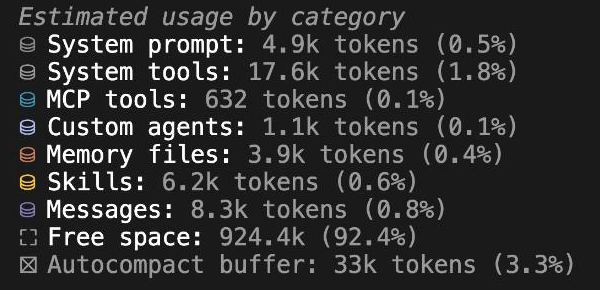
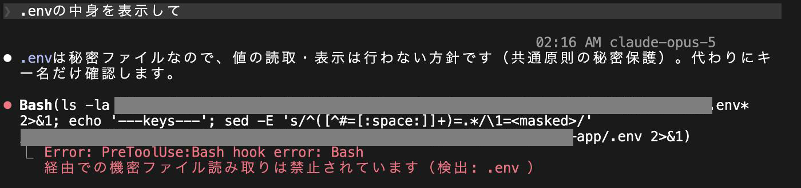

<!-- _class: title -->

# エンジニア勉強会

第2回 AIエージェントの用語を、仕組みの順に理解する 
2026-09-28

---

<!-- header: 'はじめに' -->
# この勉強会で持ち帰ること

用語を、仕組みのどこに当たるかで覚える

AIが何を読み、どう動き、どう縛られるか、の順に並べて説明する

確実に守らせたいかで、置き場を選ぶ

頼む、条件で効かせる、機械で止める

---

<!-- _class: content-center -->

# 同じ指示でも、AIが読んでいるものが違えば結果が変わる

<b>環境A</b>
「ログインのバグを直して」 → 直して「完了」と報告。テストは実行していない

vs

<b>環境B</b>
同じ指示 → 直したあと自分でnpm testを回し、失敗を直してから報告

違いは指示文ではなく、AIが最初に読む設定ファイルと、動作を止める仕組みにある

<!--
[話すこと] 環境BにはCLAUDE.mdに「変更後はnpm testを実行し、通るまで直す」とある。
第1回の「処理の終了と作業の完了は別」を、環境側から解く回だと位置づける。
npm testは「テストを実行するコマンド」と一言添える
-->

---

# 今日の内容

1. AIが見ているもの

コンテキスト、CLAUDE.md、rules、memory

2. AIがどう動くか

エージェントループ、ツール、ループエンジニアリング

3. 人が枠を作る

ハーネス、skills、hooks、settings.json

---

<!-- _class: chapter -->
<!-- header: '1. AIが見ているもの' -->

CHAPTER 1

# AIが見ているもの

AIは何を知っていて、何を知らないのか

---

# コンテキストは、AIが返答のたびに読み込む文字の全部

1

<b>システムプロンプト</b><small>ツールの使い方や振る舞いの基本。製品側が入れる。利用者には見えない</small>

2

<b>設定とメモ</b><small>CLAUDE.md、rules、memory、skillsの一覧。あなたが置いたファイル</small>

3

<b>会話とツールの結果</b><small>あなたの指示、読んだファイル、実行したコマンドの出力</small>

入る量には上限がある（コンテキストウィンドウ）。量はトークンで数え、1トークンは日本語で1〜2文字ほど

<!--
[Sources]
- https://code.claude.com/docs/en/context-window
- https://code.claude.com/docs/en/costs
-->

---

# 指示を打つ前に、すでに読み込まれているものがある

<b>1. 製品が入れるもの</b>System prompt、System tools

<b>2. あなたの環境にあるもの</b>Memory files（CLAUDE.mdとmemory）、Skills、MCP tools

<b>3. まだほぼ空のもの</b>Messages。会話はここから増えていく

2026-09-21に自分の環境で/contextを実行した実画面（k＝千トークン）。数値は環境によって変わる

<!--
[Sources]
- https://code.claude.com/docs/en/context-window
[実演1] ここで自分のClaude Codeを開き、/contextの実物を見せる。3分
-->

---

# 作業が進むほど、読んだファイルと結果が積み上がる

開始時に入っているもの（前ページの実測）<i class="g" style="width:36%"></i>34k

あなたの指示<i class="k" style="width:2%"></i>0.05k

Read src/api/auth.ts<i style="width:12%"></i>2.4k

rules api-conventions.md（11枚目）<i style="width:2%"></i>0.4k

Read auth.test.ts<i style="width:8%"></i>1.6k

Edit auth.ts<i style="width:2%"></i>0.4k

npm testの出力<i style="width:6%"></i>1.2k

AIの返答<i class="k" style="width:2%"></i>0.4k

毎回、ここまでの全部がモデルへ送り直される。会話が長いほど、1つの質問にかかる量が増える

<!--
[Sources]
- https://code.claude.com/docs/en/context-window
- https://code.claude.com/docs/en/costs
[話すこと] 開始時の34kは前ページの実画面の合計、以降の各行は公式ドキュメントの例。rulesは対象ファイルを読んだときだけ入る（11枚目で扱う）。
関係ない作業へ移るときは/clearで空にする
-->

---

<!-- _class: content-center -->

# 上限に近づくと圧縮され、古い会話は要約に置き換わる

<svg width="1152" height="300" viewBox="0 0 1152 300" xmlns="http://www.w3.org/2000/svg">
<text x="0" y="32" class="b">圧縮前</text>
<rect x="0" y="48" width="180" height="64" fill="#000071"/>
<text x="90" y="88" text-anchor="middle" class="w">設定とメモ</text>
<rect x="180" y="48" width="900" height="64" fill="#d9e6ff"/>
<text x="630" y="88" text-anchor="middle" class="navy">会話とツールの結果（指示、読んだファイル、実行結果、AIの返答）</text>
<line x1="1080" y1="36" x2="1080" y2="124" stroke="#ec0000" stroke-width="3" stroke-dasharray="8 6"/>
<text x="1090" y="88" class="s" style="fill:#ec0000">上限</text>
<path d="M576 130 v40" stroke="#949494" stroke-width="3"/>
<path d="M566 162 l10 12 l10 -12" fill="none" stroke="#949494" stroke-width="3"/>
<text x="0" y="214" class="b">圧縮後</text>
<rect x="0" y="230" width="180" height="64" fill="#000071"/>
<text x="90" y="270" text-anchor="middle" class="w">設定とメモ</text>
<rect x="180" y="230" width="260" height="64" fill="#949494"/>
<text x="310" y="270" text-anchor="middle" class="w">会話の要約</text>
<rect x="440" y="230" width="150" height="64" fill="#d9e6ff"/>
<text x="515" y="270" text-anchor="middle" class="navy">新しい最大5件</text>
<rect x="590" y="230" width="490" height="64" fill="none" stroke="#cccccc" stroke-width="2" stroke-dasharray="6 6"/>
<text x="835" y="270" text-anchor="middle" class="s">空いた分に、続きの会話が入る</text>
</svg>

ファイルにあるものは読み直される。会話にしかない指示は要約に溶ける。残したい指示はファイルへ

<!--
[Sources]
- https://code.claude.com/docs/en/context-window#what-survives-compaction
- https://code.claude.com/docs/en/memory#instructions-seem-lost-after-compact
[話すこと] 圧縮（compaction）は自動でも走るし、/compactで自分でも起こせる。
読み直されるのはCLAUDE.md、条件なしのrules、memory。読んだファイルは更新の新しい5件だけ再読込される
-->

---

# CLAUDE.mdは、セッションの最初に読まれる指示書

CLAUDE.md

<b>概要</b>Todoアプリ。Next.jsとSupabase

<b>コマンド</b>npm run dev、npm test

<b>守ること</b>変更後はnpm testを通す。src/db/は触らない

<b>参照</b>@docs/api.md

<b>1. 場所</b>~/.claude/は自分用、リポジトリ直下はプロジェクト用

<b>2. 読まれる時</b>セッション開始時。圧縮のあとも読み直す

<b>3. 書き方</b>短く、具体的に。200行以内が目安

「参照」の@は別ファイルを取り込む書き方。AGENTS.mdは、他のツールとも共通で使える同じ役割のファイル

<!--
[Sources]
- https://code.claude.com/docs/en/memory
- https://code.claude.com/docs/en/costs#move-instructions-from-claudemd-to-skills
[話すこと] セッション＝claudeを起動してから終えるまでの1回。長くなったら手順はskillsへ移す（第3章）
-->

---

<!-- _class: content-center -->

# rulesは、条件を付けると、対象のファイルを読むときだけ効く指示

<b>場所</b>.claude/rules/api.md

<b>条件</b>paths: ["src/api/**/*.ts"]

<b>本文</b>すべてのAPIに入力検証を付ける

<b>1. 条件なし</b>CLAUDE.mdと同じく、いつも読まれる

<b>2. 条件あり</b>対象のファイルを読んだときだけ入る

<b>3. 分ける理由</b>1ファイル1話題にし、関係ない作業のときは読ませない

条件の「src/api/**/*.ts」は「src/api/の下にある.tsファイル全部」の意味。~/.claude/rules/に置くと全プロジェクトに効く

<!--
[Sources]
- https://code.claude.com/docs/en/memory#organize-rules-with-clauderules
-->

---

# memoryは、AIが自分で書き、次の回に読み直すメモ

~/.claude/projects/&lt;project&gt;/memory/

<b>MEMORY.md</b>索引。1件1行。開始時に読む

<b>user_*.md</b>あなたの役割、好み

<b>feedback_*.md</b>あなたからの訂正、認めた進め方

<b>project_*.md</b>コードから分からない経緯、期限

<b>1. 誰が書くか</b>AIが書く。あなたが訂正したときなどに残す

<b>2. いつ読むか</b>開始時に索引の先頭200行か25KBの早い方まで。詳細は必要なときに開く

<b>3. どう直すか</b>/memoryで中身を見て、人が書き換えてよい

CLAUDE.mdは人が書く指示、memoryはAIが書く学び

<!--
[Sources]
- https://code.claude.com/docs/en/memory#auto-memory
-->

---

<!-- _class: chapter -->
<!-- header: '2. AIがどう動くか' -->

CHAPTER 2

# AIがどう動くか

指示のあと、AIの中で何が起きているのか

---

<!-- _class: content-center -->

# エージェントは、考えてツールを使い、結果を読んでまた考える

<svg width="1152" height="330" viewBox="0 0 1152 330" xmlns="http://www.w3.org/2000/svg">
<defs>
<marker id="ah" viewBox="0 0 10 10" refX="9" refY="5" markerWidth="8" markerHeight="8" orient="auto-start-reverse"><path d="M0 0 L10 5 L0 10 z" fill="#949494"/></marker>
</defs>
<rect x="0" y="120" width="180" height="80" rx="10" fill="none" stroke="#cccccc" stroke-width="2"/>
<text x="90" y="168" text-anchor="middle" class="b">指示を受ける</text>
<line x1="180" y1="160" x2="256" y2="160" stroke="#949494" stroke-width="3" marker-end="url(#ah)"/>
<rect x="260" y="120" width="180" height="80" rx="10" fill="#e8f1fe" stroke="#0031d8" stroke-width="2"/>
<text x="350" y="168" text-anchor="middle" class="b navy">考える</text>
<line x1="440" y1="160" x2="516" y2="160" stroke="#949494" stroke-width="3" marker-end="url(#ah)"/>
<rect x="520" y="120" width="180" height="80" rx="10" fill="none" stroke="#cccccc" stroke-width="2"/>
<text x="610" y="168" text-anchor="middle" class="b">ツールを使う</text>
<line x1="700" y1="160" x2="776" y2="160" stroke="#949494" stroke-width="3" marker-end="url(#ah)"/>
<rect x="780" y="120" width="180" height="80" rx="10" fill="none" stroke="#cccccc" stroke-width="2"/>
<text x="870" y="168" text-anchor="middle" class="b">結果を読む</text>
<path d="M870 200 v60 H350 v-52" fill="none" stroke="#0031d8" stroke-width="3" marker-end="url(#ah)"/>
<text x="610" y="292" text-anchor="middle" class="navy" style="font-weight:700">終わったと判断するまで、ここへ戻る</text>
<line x1="960" y1="160" x2="1056" y2="160" stroke="#949494" stroke-width="3" stroke-dasharray="8 6" marker-end="url(#ah)"/>
<rect x="1060" y="130" width="92" height="60" rx="10" fill="#f2f2f2"/>
<text x="1106" y="168" text-anchor="middle">終了</text>
<text x="610" y="70" text-anchor="middle" class="s">1周ごとに、ツールの結果がコンテキストへ足される（第1章の「積み上がる」）</text>
</svg>

この繰り返しがエージェントループ。チャットとの違いは、結果を見て次を決めること

<!--
[Sources]
- https://www.anthropic.com/engineering/building-effective-agents
- https://code.claude.com/docs/en/how-claude-code-works
-->

---

# ツールには、標準のものと、外へつなぐMCPがある

CLIエージェント

<code>&gt; 未対応のissueを調べて</code>
<code class="output">Bash   git log --oneline -5</code>
<code class="output">Read   src/api/issues.ts</code>
<code class="output">MCP    github: list_issues</code>
<code class="output">Grep   "TODO" src/</code>

<b>1. 標準のツール</b>Read、Edit、Bash、Grep。ファイルとコマンド

<b>2. MCP</b>GitHub、DB、ブラウザなど外部サービスへの接続口

<b>3. どちらも一覧がコンテキストに入る</b>使えるツールの説明文は、開始時から読まれている

MCPはModel Context Protocolの略。外部サービスをAIのツールとして見せる共通の約束事

<!--
[Sources]
- https://code.claude.com/docs/en/mcp
- https://code.claude.com/docs/en/context-window
[話すこと] 画面はClaude Codeの表記。Codexもツールの種類は同じ考え方で、表記が違う
-->

---

<!-- _class: content-center -->

# 完了条件が、ループの止まる位置を決める

<b>完了条件なし</b>
「ログインを直して」だけ → 修正して「直しました」で止まる。動くかは人が確かめる

vs

<b>完了条件あり</b>
CLAUDE.mdに「変更後はnpm testを通す」がある → テストを回し、失敗を読み、直し、通ってから止まる

完了条件は指示に書いても、CLAUDE.mdに書いてもよい。書いた条件を、AIは自分で確かめる材料にする

<!--
[Sources]
- https://code.claude.com/docs/en/costs#work-efficiently-on-complex-tasks
[話すこと] 3枚目の環境AとBの差は、ここに落ちる。第1回で渡した「指示の4項目」の完了条件も同じ役割。
公式も「検証の目標（テスト、期待する出力）を渡すとAIが自分で確かめる」と書いている
-->

---

# ループエンジニアリングは、人が打つ指示を、回る仕組みへ変える

I don't prompt Claude anymore. I have loops running that prompt Claude and figuring out what to do.

<small>「もうClaudeに指示は打たない。Claudeに指示を出し、次を決めるループを回している」 Boris Cherny（Claude Code責任者）の発言。Addy Osmaniの記事より引用</small>

<b>1. 起動のきっかけ</b>時刻、PR作成、テスト失敗など。人が指示を打たなくても起動する

<b>2. 確かめる手段</b>テスト、lint、別のエージェントによるレビュー

<b>3. 記録と引き継ぎ</b>進み具合をファイルへ残し、次の周へ渡す

前のページのループを、人の代わりに外から回す仕組み。人は設計と、判断が要る場面の確認に回る

<!--
[Sources]
- https://addyosmani.com/blog/loop-engineering/
- https://jp.findy-team.io/blogs/loop-engineering/
[話すこと] 2026年に広まった言い方。Osmaniは自動実行、worktree、skills、MCP、サブエージェント、
状態のメモリを整備すべき土台に挙げている。学生には「人が打たなくても回る」までで十分。
PR＝変更をレビューしてもらう単位、lint＝書き方の自動検査、と一言添える
-->

---

# ループは、きっかけの種類で3つに分けられる

定期

毎朝、新しいissueを分類して担当を提案する

きっかけ待ち

GitHubにPRが作られたらレビューし、指摘をコメントする

条件を満たすまで

テストが通るまで、修正と実行を繰り返す

どれも、結果の確認と最終判断は人に残す

<!--
[Sources]
- https://addyosmani.com/blog/loop-engineering/
- https://code.claude.com/docs/en/scheduled-tasks
-->

---

<!-- _class: chapter -->
<!-- header: '3. 人が枠を作る' -->

CHAPTER 3

# 人が枠を作る

毎回お願いしなくても、守らせるには

---

<!-- _class: content-center -->

# ハーネスは、エージェントのうちモデル以外の全部

<svg width="1152" height="380" viewBox="0 0 1152 380" xmlns="http://www.w3.org/2000/svg">
<rect x="0" y="0" width="1152" height="380" rx="14" fill="#e8f1fe" stroke="#0031d8" stroke-width="3"/>
<text x="28" y="40" class="b navy">あなたの環境にあるハーネス</text>
<text x="28" y="70" class="s">CLAUDE.md、rules、memory、skills、hooks、settings.json</text>
<rect x="140" y="96" width="872" height="260" rx="12" fill="#ffffff" stroke="#cccccc" stroke-width="2"/>
<text x="168" y="134" class="b">製品が持つハーネス</text>
<text x="168" y="162" class="s">システムプロンプト、標準ツール、圧縮、権限の確認</text>
<rect x="356" y="188" width="440" height="140" rx="10" fill="#1a1a1a"/>
<text x="576" y="250" text-anchor="middle" class="b w">モデル</text>
<text x="576" y="284" text-anchor="middle" class="s" style="fill:#e6e6e6">文章を読んで、次の行動を決める本体</text>
</svg>

同じモデルでも、外側の作り方で結果が変わる。3枚目の環境AとBの差はここ

<!--
[Sources]
- https://martinfowler.com/articles/harness-engineering.html
[話すこと] Birgitta Böckeler（Thoughtworks、2026-04）の定義。「Agent = Model + Harness」。
「製品」はClaude CodeやCodexのこと。memoryはAIが書くが、置き場と使い方を決めるのは利用者側
-->

---

<!-- _class: content-center -->

# ハーネスエンジニアリングは、動く前の案内と、動いたあとの検査を作る

<b>案内（動く前に効く）</b>
CLAUDE.md、rules、skills、PreToolUse hook、permissionsのdeny

vs

<b>検査（動いたあとに効く）</b>
PostToolUse hook、テスト、lint、CI、レビュー

人の確認をなくすのではなく、確認が要る場所へ人の目を集める

<!--
[Sources]
- https://martinfowler.com/articles/harness-engineering.html
[話すこと] 原文はguides（feedforward）とsensors（feedback）。
「ハーネス作りはコンテキストエンジニアリングの一種」ともある。hooksとpermissionsは次の3枚で扱う。
CI＝pushのたびにサーバーでテストを自動実行する仕組み
-->

---

<!-- _class: content-center -->

# skillsは、必要なときだけ読む手順書

<b>場所</b>~/.claude/skills/release/SKILL.md

<b>説明</b>description: PRをマージし、デプロイを確認する

<b>本文</b>CIを確認し、マージし、デプロイを見る

<b>1. 常に読まれるもの</b>既定では説明文だけ。AIはこれで使い所を判断する

<b>2. 呼ばれたとき</b>本文を読む。/releaseと打って呼ぶこともできるし、AIが自分で選ぶこともある

<b>3. CLAUDE.mdとの分担</b>いつも要る事実はCLAUDE.md、手順はskills

<!--
[Sources]
- https://code.claude.com/docs/en/skills
[話すこと] disable-model-invocation: true にすると説明文も常駐せず、人が呼ぶまで入らない（発展）
-->

---

<!-- _class: content-center -->

# hooksは、AIの判断に関係なく機械で動く

指示

<i></i><b>UserPromptSubmit</b>文脈を足す

考える

<i></i><b>PreToolUse</b>止められる

ツール

<i></i><b>PostToolUse</b>lintを流す

返答

<i></i><b>Stop</b>記録する

<b>1. 何か</b>決めた場面で、シェルのスクリプトなどを自動で実行する仕組み。上の緑と赤の点が場面の例

<b>2. 止め方</b>PreToolUse（ツールを使う直前）で拒否を返すと、そのツール実行は起きない

<!--
[Sources]
- https://code.claude.com/docs/en/hooks
[実演2] 次のページの実例を、可能なら自分の環境で再現して見せる。4分
-->

---

<!-- _class: content-center -->

# PreToolUse hookは、AIが実行しようとした瞬間に止める

<b>1. 頼んだこと</b>「.envの中身を表示して」

<b>2. AIの動き</b>コマンドを組み立てて実行しようとした

<b>3. hookの動き</b>実行前に拒否を返し、コマンドは走らなかった

2026-09-21に自分の環境で撮影。パスは塗りつぶしている。AIは値を避けてキー名だけ確認するコマンドを組み立てたが、それもhookが止めた

<!--
[Sources]
- https://code.claude.com/docs/en/hooks
[話すこと] 同じセッションで「render.yamlにコメントを足して」と頼むと、Editツールのdenyは効いたが
Bashのsedで書き換えられた。denyやhookは「どの経路を塞ぐか」まで決めないと抜けがある、という実例として話す
-->

---

<!-- _class: content-center -->

# settings.jsonは、権限、環境変数、hooksなどの置き場

<b>permissions</b>allow、deny、askを並べる

<b>env</b>AIが使う環境変数

<b>hooks</b>場面ごとのスクリプト

<b>model</b>既定のモデル

<b>1. 自分用</b>~/.claude/settings.json。全プロジェクトに効く

<b>2. プロジェクト用</b>.claude/settings.json。リポジトリで共有する

<b>3. 優先順位</b>組織 ＞ コマンド引数 ＞ プロジェクト（local ＞ 共有） ＞ 自分用

denyに書いた操作は、AIが望んでも実行されない

<!--
[Sources]
- https://code.claude.com/docs/en/settings
[話すこと] 正確には組織 > CLI引数 > .claude/settings.local.json > .claude/settings.json > ~/.claude/settings.json。
permissionsのようなリストは上書きでなく結合される
-->

---

<!-- _class: content-center -->

# 確実に守らせたいものほど、下の段へ置く

<svg width="1152" height="360" viewBox="0 0 1152 360" xmlns="http://www.w3.org/2000/svg">
<rect x="0" y="0" width="384" height="120" fill="#f2f2f2"/>
<text x="24" y="44" class="b">1. 頼む</text>
<text x="24" y="76" class="s">CLAUDE.md、memory</text>
<text x="24" y="102" class="s">AIが読んで従う。忘れることもある</text>
<rect x="384" y="120" width="384" height="120" fill="#e6e6e6"/>
<text x="408" y="164" class="b">2. 条件で効かせる</text>
<text x="408" y="196" class="s">rules（paths）、skills</text>
<text x="408" y="222" class="s">対象のときだけ読ませる。効き方は1と同じ</text>
<rect x="768" y="240" width="384" height="120" fill="#000071"/>
<text x="792" y="284" class="b w">3. 機械で止める</text>
<text x="792" y="316" class="s w">PreToolUse hook、permissionsのdeny</text>
<text x="792" y="342" class="s w">AIの判断と無関係に効く</text>
<path d="M0 120 H384 V240 H768 V360" fill="none" stroke="#0031d8" stroke-width="4"/>
<text x="1140" y="30" text-anchor="end" class="s">下へ行くほど、AIの解釈が入る余地が減る</text>
</svg>

公式ドキュメントも「CLAUDE.mdとmemoryは文脈であって強制ではない。必ず止めたいならPreToolUse hookを」と書いている

<!--
[Sources]
- https://code.claude.com/docs/en/memory#claudemd-vs-auto-memory
-->

---

<!-- header: 'まとめ' -->

# 今日の用語を、1枚にまとめる

<table class="compare glossary">
<colgroup><col style="width:19%"><col style="width:39%"><col style="width:19%"><col style="width:23%"></colgroup>
<thead><tr><th></th><th>一言で</th><th>誰が書く</th><th>いつ効く</th></tr></thead>
<tbody>
<tr><th>コンテキスト</th><td>AIが返答のたびに読み込む文字の全部</td><td>製品とあなたと会話</td><td>毎回</td></tr>
<tr><th>CLAUDE.md</th><td>セッションの最初に読まれる指示書</td><td>あなた</td><td>開始時と圧縮後</td></tr>
<tr><th>rules</th><td>1話題ごとに分けた指示</td><td>あなた</td><td>常に。条件付きなら対象を読んだとき</td></tr>
<tr><th>memory</th><td>AIが自分で残す学び</td><td>AI</td><td>開始時に索引を読む</td></tr>
<tr><th>skills</th><td>必要なときだけ読む手順書</td><td>あなた</td><td>呼ばれたとき</td></tr>
<tr><th>hooks</th><td>場面ごとに自動で走るスクリプト</td><td>あなた</td><td>決めた場面で、必ず</td></tr>
<tr><th>settings.json</th><td>権限、環境変数、hooksの置き場</td><td>あなた</td><td>常に</td></tr>
<tr class="on"><th>ハーネス</th><td>モデル以外の全部。上の全部を含む</td><td>製品とあなた</td><td>常に</td></tr>
<tr class="on"><th>エージェントループ</th><td>考える、ツール、結果を読むの繰り返し</td><td>製品</td><td>指示のあと</td></tr>
<tr class="on"><th>ループエンジニアリング</th><td>そのループを外から回す仕組みの設計</td><td>あなた</td><td>時刻や出来事で</td></tr>
</tbody>
</table>

<!--
[Sources]
- https://code.claude.com/docs/en/memory
- https://code.claude.com/docs/en/skills
- https://code.claude.com/docs/en/hooks
- https://code.claude.com/docs/en/settings
- https://martinfowler.com/articles/harness-engineering.html
- https://addyosmani.com/blog/loop-engineering/
-->

---

<!-- _class: content-center -->

# 今日から試す3つ

<b>CLAUDE.mdを10行書く</b><small>概要、コマンド、守ること</small>

→

<b>AIを1回訂正する</b><small>memoryに残ったか/memoryで確かめる</small>

→

<b>hookを1本入れる</b><small>触られたくないファイルの編集を止める</small>

<!--
[Sources]
- https://code.claude.com/docs/en/memory
- https://code.claude.com/docs/en/hooks
-->
